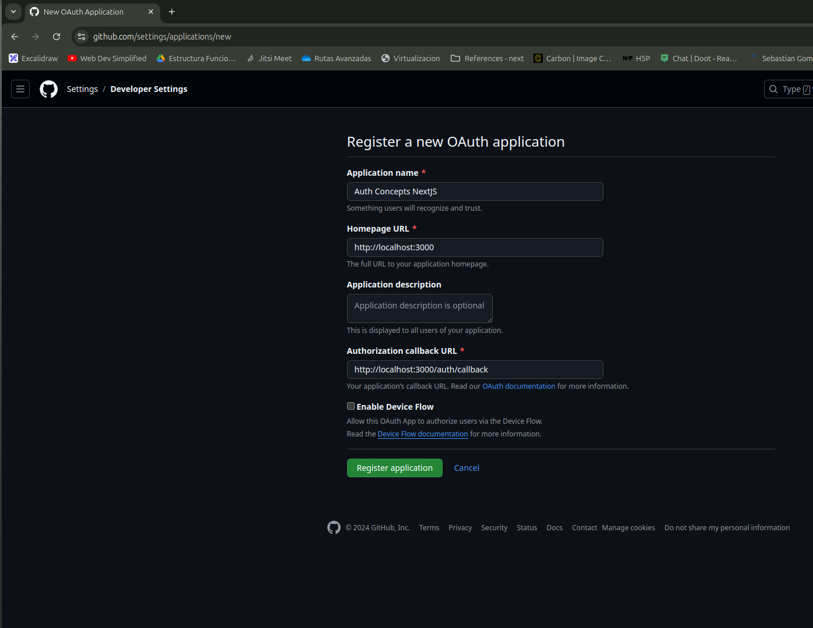

# Auth Concepts NextJS

This is a NextJS App focused in the auth concepts.

## Install dependencies && Run project

1. Install dependencies
```bash
npm install
```
2. Run project
```bash
npm run dev
```

Open [http://localhost:3000](http://localhost:3000) with your browser to see the result.

## Auth with GitHub
You need to create a github account, then login and go to [https://github.com/settings/apps](https://github.com/settings/apps).
The should be able to create a new OAuth application
<p align="center">
  
  <h5 align="center">Create Github OAuth App</h5>
</p>

After you have created **CLIENT_ID** and **CLIENT_SECRET**, then you can copy the file .env.example ```.env.example``` and paste it into ```.env``` and put your credentials.

http://localhost:3000/api/auth/callback/github